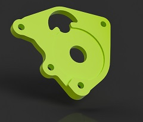
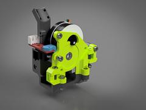
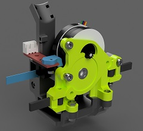
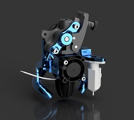
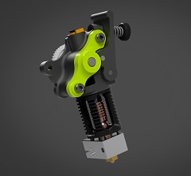
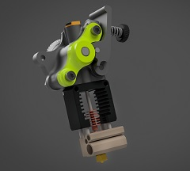
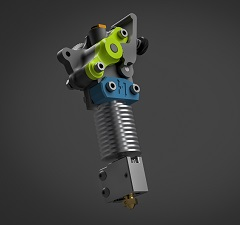

# HextrudORT
Light, small and efficient extruder based on the popular Bondtech BMG.

## Why the HextrudORT:
The HextrudORT is the simple combination of a proven concept and the desire to obtain a compact and lightweight print head for fast 3D printing.  
Re-using the internal components from the popular and efficient [Bondtech BMG](https://www.bondtech.se/en/product/bmg-extruder/){:target="_blank"}, this extruder was specifically designed to be merged into the [HevORT's](www.hevort.com) print head carriage.

 
 
<iframe width="200" height="150" src="https://www.youtube.com/embed/5HKC9tRqtTw" frameborder="0" allow="accelerometer; autoplay; clipboard-write; encrypted-media; gyroscope; picture-in-picture" allowfullscreen></iframe> <iframe width="200" height="150" src="https://www.youtube.com/embed/h-ukClHtai4" title="YouTube video player" frameborder="0" allow="accelerometer; autoplay; clipboard-write; encrypted-media; gyroscope; picture-in-picture" allowfullscreen></iframe> <iframe width="200" height="150" src="https://www.youtube.com/embed/YIFRRQczDmg" frameborder="0" allow="accelerometer; autoplay; clipboard-write; encrypted-media; gyroscope; picture-in-picture" allowfullscreen></iframe>

 

 

### Modular approach!
Several configurations can be created to support all HevORT XY gantry types as well as many populat HotEnds.  Select from the two tables here below your desired configuration and assemble them together :) 

### Change log: 
[Check here for change history:](https://github.com/MirageC79/HextrudORT/releases)

## Carriages

Item Click for CAD|HevORT XY gantry to be used with|Data|Release Status
---------------------|--------------------------------|---|:------------:
{:target="_blank"}|*This is up to your imagination*|[STLs](https://www.thingiverse.com/thing:4796948){:target="_blank"}     Merge this plate to your CAD in order install the Hextrudort|**RELEASED March 2021**
{:target="_blank"}|STD/HT MGN9|[STLs](https://www.thingiverse.com/thing:4793215){:target="_blank"}     [BOM & Notes](/files/CARRIAGE/STDHT_MGN9/BOM_HextrudORT_Carriage_STDHT_MGN9.htm){:target="_blank"}     [Excel](/files/CARRIAGE/STDHT_MGN9/BOM_HextrudORT_Carriage_STDHT_MGN9.xlsx)|**RELEASED March 2021**
{:target="_blank"}|STD/HT MGN12|[STLs](https://www.thingiverse.com/thing:4810748){:target="_blank"}     [BOM & Notes](/files/CARRIAGE/STDHT_MGN12/BOM_HextrudORT_Carriage_STDHT_MGN12.htm){:target="_blank"}     [Excel](/files/CARRIAGE/STDHT_MGN12/BOM_HextrudORT_Carriage_STDHT_MGN12.xlsx)|**RELEASED March 2021**
To come...|HD9|...|*est. April 2021*
{:target="_blank"}|HD12(MGN12)|[STLs](https://www.thingiverse.com/thing:4790412){:target="_blank"}     [BOM & Notes](/files/CARRIAGE/HD12/BOM_HextrudORT_Carriage_HD12.htm){:target="_blank"}     [Excel](/files/CARRIAGE/HD12/BOM_HextrudORT_Carriage_HD12.xlsx)|**RELEASED March 2021**

## Extruder & HotEnds Configs

Item Click for CAD|HotEnd|Data|Release Status
---------------------|------|----|:------------:
{:target="_blank"}|[RAPIDO & RAPIDO UHF](https://www.phaetus.com/rapido-plus/)|[STLs](https://github.com/MirageC79/HextrudORT/tree/main/files/HOTEND_EXTRUDER/RAPIDO/STLs){:target="_blank"}     [BOM & Notes](/files/HOTEND_EXTRUDER/RAPIDO/BOM_HextrudORT_Extruder_Rapido.htm){:target="_blank"}     [Excel](/files/HOTEND_EXTRUDER/RAPIDO/BOM_HextrudORT_Extruder_Rapido.xlsx)|**V1.65 March 2023**
|[Nova HotEnd](https://3dpassion.com/nova)|[STLs](https://www.thingiverse.com/thing:4790773){:target="_blank"}     [BOM & Notes](/files/HOTEND_EXTRUDER/NOVA/BOM_HextrudORT_Extruder_NOVA.htm){:target="_blank"}     [Excel](/files/HOTEND_EXTRUDER/NOVA/BOM_HextrudORT_Extruder_NOVA.xlsx)|**RELEASED March 2021**
{:target="_blank"}|[Dragon HotEnd](https://s.click.aliexpress.com/e/_AD0Qow)|[STLs](https://www.thingiverse.com/thing:4796562){:target="_blank"}     [BOM & Notes](/files/HOTEND_EXTRUDER/DRAGON/BOM_HextrudORT_Extruder_Dragon.htm){:target="_blank"}     [Excel](/files/HOTEND_EXTRUDER/DRAGON/BOM_HextrudORT_Extruder_Dragon.xlsx)|**RELEASED March 2021**
{:target="_blank"}|[Mosquito HotEnd](https://www.sliceengineering.com/collections/mosquito-the-professional-hotend)|[STLs](https://www.thingiverse.com/thing:4965960){:target="_blank"}     [BOM & Notes](/files/HOTEND_EXTRUDER/MOSQUITO/BOM_HextrudORT_Extruder_Mosquito.htm){:target="_blank"}     [Excel](/files/HOTEND_EXTRUDER/MOSQUITO/BOM_HextrudORT_Extruder_Mosquito.xlsx)|**RELEASED September 2021**
{:target="_blank"}|[E3D V6 & Volcano HotEnd](https://e3d-online.com/)|[STLs](https://www.thingiverse.com/thing:4971939){:target="_blank"}     [BOM & Notes](/files/HOTEND_EXTRUDER/E3DV6/BOM_HextrudORT_Extruder_E3D.htm){:target="_blank"}     [Excel](/files/HOTEND_EXTRUDER/E3DV6/BOM_HextrudORT_Extruder_E3D.xlsx)|**RELEASED September 2021**

 

## Report Issues [HERE](https://github.com/MirageC79/HextrudORT/issues)

 

## Back to [HevORT project](https://www.hevort.com)

 

**If you like my work** and would like to help me covering the costs associated to the development and improvement of this project,  
click the button here below :)

<form action="https://www.paypal.com/cgi-bin/webscr" method="post" target="_top">
<input type="hidden" name="cmd" value="_s-xclick" />
<input type="hidden" name="hosted_button_id" value="LYP98YKUSLXN2" />
<input type="image" src="https://www.paypalobjects.com/en_US/i/btn/btn_donateCC_LG.gif" border="0" name="submit" title="PayPal - The safer, easier way to pay online!" alt="Donate with PayPal button" />

</form>

Thank you!
Olivier

 FaceBook Group  
  Discussion Forum  
 Discord Server  
